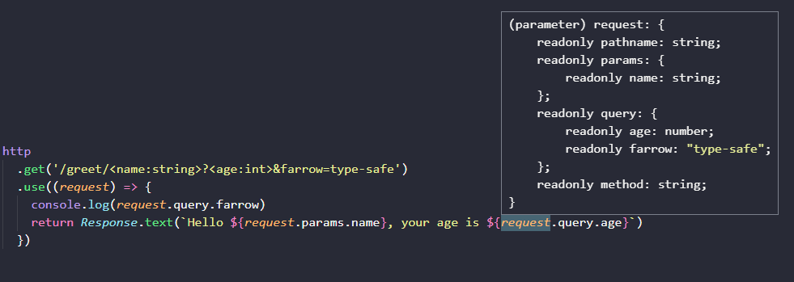

# 𝓕𝓪𝓻𝓻𝓸𝔀

<p align="center">
  
</p>

<p align="center">
  <a href="https://www.npmjs.com/package/farrow-http" rel="nofollow">
    
  </a>
  <a href="https://travis-ci.org/Lucifier129/farrow" rel="nofollow">
    
  </a>
  <a href="https://github.com/Lucifier129/farrow#readme">
    
  </a>
  <a href="https://github.com/Lucifier129/farrow/graphs/commit-activity">
    
  </a>
  <a href="https://github.com/Lucifier129/farrow/blob/master/LICENSE">
    
  </a>
  <a href="https://twitter.com/guyingjie129" rel="nofollow">
    
  </a>
</p>

**Farrow** is a functional-style web framework for node.js written by TypeScript

[API Documentation](./docs/index.md) | [Example](./packages/example)

## Benefits

- Expressive HTTP middleware like [Koa](https://github.com/koajs/koa) but no need to modify `req/res` or `ctx`
- Strongly typed and type-safe from request to response via powerful schema-based validation
- Provide React-Hooks-like mechanism which is useful for reusing code and integrating other parts of Server like database connection
- Easy to learn and use if you were experienced in expressjs/koajs



## Environment Requirement

- TypeScript 4.1
- Node.js 12.0

## Usage

- [How to install](#how-to-install)
- [How to setup a server](#how-to-setup-a-server)
- [How to serve static assets](#how-to-serve-static-assets)
- [How to respond text or json or html or file](#how-to-respond-text-or-json-or-html-or-file)
- [How to access request info](#how-to-access-request-info)
- [How to match specific request](#how-to-match-specific-request)
- [How to pass new request info for downstream middleware](#how-to-pass-new-request-info-for-downstream-middleware)
- [How to filter and manipulate response in upstream middleware](#how-to-filter-and-manipulate-response-in-upstream-middleware)
- [How to set response headers](#how-to-set-response-headers)
- [How to set response cookies](#how-to-set-response-cookies)
- [How to set response status](#how-to-set-response-status)
- [How to redirect](#how-to-redirect)
- [How to merge responses](#how-to-merge-responses)
- [How to add router](#how-to-add-router)
- [How to add view-engine](#how-to-add-view-engine)
- [How to write a farrow hooks](#how-to-write-a-farrow-hooks)

### How to install

```shell
# via npm
npm install --save farrow-pipeline farrow-schema farrow-http

# via yarn
yarn add farrow-pipeline farrow-schema farrow-http
```

### How to setup a server

```typescript
import { Http, Response } from 'farrow-http'

const http = Http()

// add http middleware
http.use(() => {
  // returning response in middleware
  return Response.text(`Hello Farrow`)
})

http.listen(3000)
```

### How to serve static assets

```typescript
http.serve('/static', dirname)
```

### How to respond text or json or html or file

```typescript
// respond text
http.use(() => {
  return Response.text(`Farrow`)
})

// respond json
http.use(() => {
  return Response.json({
    farrow: true,
    data: {},
  })
})

// respond html
http.use(() => {
  return Response.html(`<h1>Farrow</h1>`)
})

// respond file
http.use(() => {
  return Response.file(filename)
})
```

### How to access request info

```typescript
http.use((request) => {
  // access request pathname
  console.log('pathname', request.pathname)

  // access request method
  console.log('method', request.method)

  // access request query
  console.log('query', request.query)

  // access request body
  console.log('body', request.body)

  // access request headers
  console.log('headers', request.headers)

  // access request cookies
  console.log('cookies', request.cookies)
})
```

### How to match specific request

Click [Router-Url-Schema](./docs/http.md#router-url-schema) to read more

```typescript
// http.match(schema).use(...middlewares)
// farrow will validate request info and extract the data for middlewares
// schema has the similar shape like request info: { pathname, method, query, body, headers, cookies, params }
// the params is readed from path-to-regexp if you config schema.pathname to be /product/:id, and params is equal to { id }
// learn more about pathname: https://github.com/pillarjs/path-to-regexp#usage
http
  .match({
    pathname: '/product',
    // if method was not given, the default value wounld be `GET`.
    query: {
      productId: Number,
    },
  })
  .use((request) => {
    // productId is a number
    console.log('productId', request.query.productId)
  })

// or using routing-methods
http.get('/get0/<arg0:int>?<arg1:int>').use((request) => {
  return Response.json({
    type: 'get',
    request,
  })
})
```

### How to pass new request info for downstream middleware

```typescript
http.use((request, next) => {
  // no need to modify the request, just calling next(new_request) with a new request info
  return next({
    ...request,
    pathname: '/fixed',
  })
})

http.use((request) => {
  // request pathname will be '/fixed'
  console.log('pathname', request.pathname)
})
```

### How to filter and manipulate response in upstream middleware

```typescript
http.use(async (request, next) => {
  // next() returning response received from downstream
  let response = await next()
  let headers = {
    'header-key': 'header-value',
  }
  // filter or merge response and return
  return Response.headers(headers).merge(response)
})

http.use(async (request) => {
  return Response.json(request)
})
```

### How to set response headers

```typescript
http.use(() => {
  return Response.header('a', '1').header('b', '2').text('ok')
})

// or

http.use(() => {
  return Response.headers({
    a: '1',
    b: '2',
  }).text('ok')
})
```

### How to set response cookies

```typescript
http.use(() => {
  return Response.cookie('a', '1').cookie('b', '2').text('ok')
})

// or

http.use(() => {
  return Response.cookies({
    a: '1',
    b: '2',
  }).text('ok')
})
```

### How to set response status

```typescript
http.use(() => {
  return Response.status(404, 'Not Found').html('some text')
})
```

### How to redirect

```typescript
http.use(() => {
  return Response.redirect(targetUrl)
})
```

### How to merge responses

```typescript
let response0 = Response.status(200)
let response1 = Response.header('a', '1')
let response2 = Response.header('b', '2')
let response3 = Response.cookie('c', '3')

let response = Response.merge(response0, response1, response2, response3)
// or
let response = response0.merge(response1, response2, response3)
```

### How to add router

`Router()` has the same methods like `Http()` except `http.listen(...)` and `http.server()`

```typescript
import { Http, Router, Response } from 'farrow-http'

// create http
const http = Http()

// create product router
const product = Router()

// create user router
const user = Router()

// add sub route for product
http.route('/product').use(product)

// add sub route for user
http.route('/user').use(user)

http.listen(3000)

// handle product router
product
  .match({
    // this will match /product/:id
    pathname: '/:id',
    params: {
      id: Number,
    },
  })
  .use(async (request) => {
    return Response.json({
      productId: request.params.id,
    })
  })

product
  .match({
    // this will match /product/info
    pathname: '/info',
    params: {
      id: Number,
    },
  })
  .use(async (request) => {
    return Response.json({
      productInfo: {},
    })
  })

// handle user router
user
  .match({
    // this will match /user/:id
    pathname: '/:id',
    params: {
      id: Number,
    },
  })
  .use(async (request) => {
    return Response.json({
      userId: request.params.id,
    })
  })

user
  .match({
    // this will match /user/info
    pathname: '/info',
    params: {
      id: Number,
    },
  })
  .use(async (request) => {
    return Response.json({
      userInfo: {},
    })
  })
```

### How to add view-engine

`Farrow` provide an official server-side rendering library based on `React`, but you can implement your own via `Response.html(...)` or `Response.stream(...)`.

```shell
# via npm
npm install --save react react-dom farrow-react

# via yarn
yarn add react react-dom farrow-react
```

```tsx
import React from 'react'
import { useReactView } from 'farrow-react'
// use Link to auto prefix basename came from http.route(name, ...) or router.route(name, ...)
import { Link } from 'farrow-react/Link'

http.use(() => {
  let ReactView = useReactView({
    docType: '<!doctype html>', // optional, specify the doctype in html response
    useStream: true, // optional, if ture it will use ReactDOMServer.renderToNodeStream internally
  })

  return ReactView.render(
    <>
      <h1>Hello Farrow-React</h1>
      <Link href="/">Home</Link>
    </>,
  )
})
```

### How to write a farrow hooks

**Note**: farrow-hooks shared similar rules or limitations with react-hooks, all farrow-hooks have to place before the first `await` in the function body.

```tsx
import { createContext } from 'farrow-pipeline'
import { Http, HttpMiddleware } from 'farrow-http'
import { useReactView } from 'farrow-react'

// declare an interface
interface User {
  id: string
  name: string
  email: string
}

// define a farrow context via interface
const UserContext = createContext<User | null>(null)

// define a custom farrow hooks
const useUser = (): User => {
  // every farrow context provide a built-in hooks, Context.use()
  let ctx = UserContext.use()

  if (ctx.value === null) {
    throw new Error(`user not found`)
  }

  return ctx.value
}

// define a provider middleware
const UserProvider = (): HttpMiddleware => {
  return async (request, next) => {
    let userCtx = UserContext.use()
    // assume defining somewhere
    let session = SessionContext.use().value
    let db = DbContext.use().value

    if (!request?.cookies?.token) {
      return next()
    }

    let userId = await session.read(request?.cookies?.token)

    let user = await db.query({
      User: {
        token,
      },
    })

    // write user context
    userCtx.value = user

    return next()
  }
}

const http = Http()

http.use(UserProvider)

http
  .match({
    pathname: '/userinfo',
  })
  .use(async (request, next) => {
    let ReactView = useReactView()
    // read user from hooks
    let user = useUser()

    return ReactView.render(<div>{JSON.stringify(user)}</div>)
  })
```

## Author

👤 **Jade Gu**

- Twitter: [@guyingjie129](https://twitter.com/guyingjie129)
- Github: [@Lucifier129](https://github.com/Lucifier129)

## 🤝 Contributing

Contributions, issues and feature requests are welcome!

Feel free to check [issues page](https://github.com/Lucifier129/farrow/issues).

## Show your support

Give a ⭐️ if this project helped you!

## 📝 License

Copyright © 2020 [Jade Gu](https://github.com/Lucifier129).

This project is [MIT](https://github.com/Lucifier129/farrow/blob/master/LICENSE) licensed.
